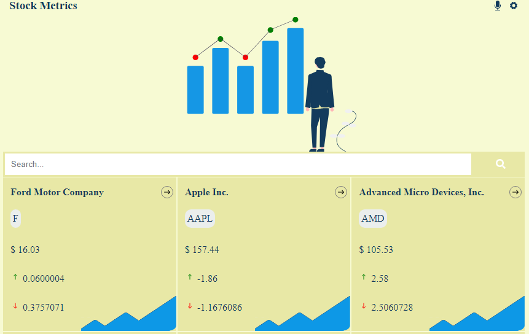

# Stock Metrics

> Stock metrics is an app that allows you to display active stocks of companies ,and you can see I ncome statement of past 5years by selecting a selected company.It is built with react and redux .
> 



<br/>

# Live Demo

[Live Link](https://stock-metrics42.netlify.app/)

# Presentation

[video Link](https://www.loom.com/share/dd6b201ab1b4401485189c69ba06888f)


<br/>


Additional description about the project and its features.
## Built With

- Major languages (JavaScript)
- Framework/Libraries (React, Redux)
- Technologies/tools used 
  
  ``` bash
  - create-react-app tool
  - Webpack(Code Bundlng et al)
  - Babel (code transpiling)
  - Jest(for testing)
  - Git(version control)
  - ESLint(JavaScript linting)
  - Stylelint(style linting)

  ```


## Getting Started

To get a local copy up and running follow these simple example steps.

### Prerequisites
 - A text editor(preferably Visual Studio Code)
### Install
  -  [Git](https://git-scm.com/downloads)
  -  [Node](https://nodejs.org/en/download/)
### Usage
#### Clone this repository

```bash
$ git clone https://github.com/mugishasam123/Stock-metrics.git
$ cd Stock-metrics
```
#### Run project

```bash
$ npm install
$ npm start # this will open it in the browser and enable hot reloading
```

  <br>

## Authors

👤 ** Mugisha Samuel**

- GitHub: [mugishasamuel](https://github.com/mugishasam123)
- LinkedIn: [mugishasamuel](https://www.linkedin.com/in/mugisha-samuel-55a905208/)


<br>

## 🤝 Contributing

Contributions, issues, and feature requests are welcome!

Feel free to check the [issues page](https://github.com/mugishasam123/Stock-metrics/issues).

<br>

## Show your support

Give a ⭐️ if you like this project!

## 📝 License

This project is [MIT](https://opensource.org/licenses/MIT) licensed.